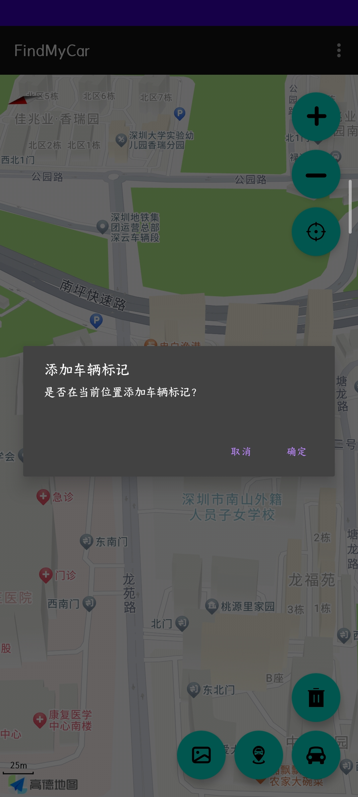
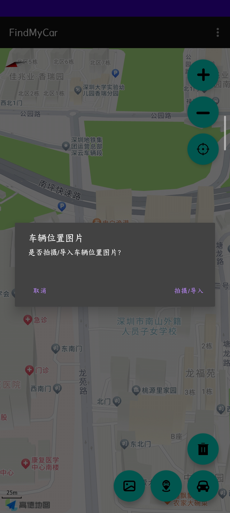
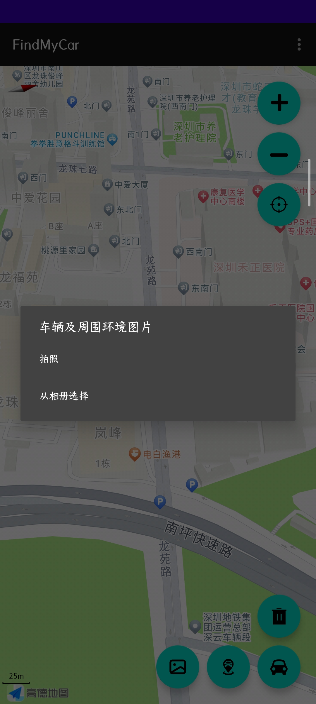
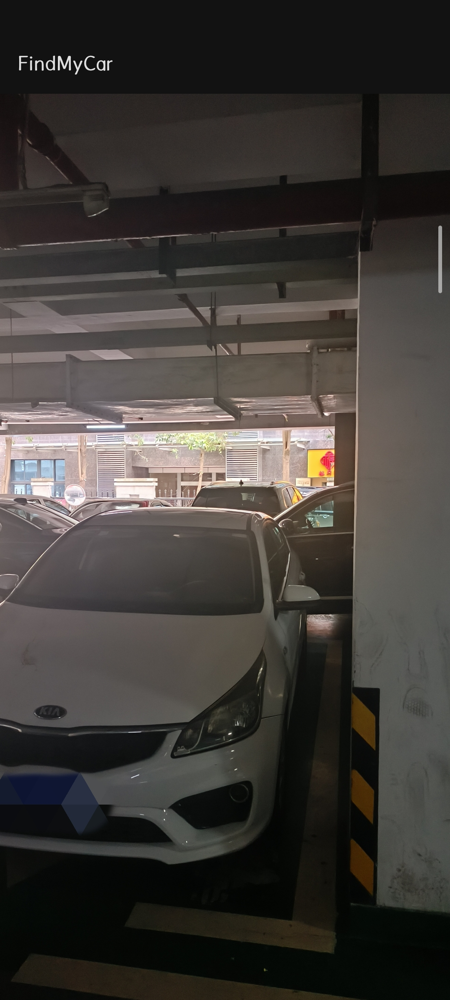
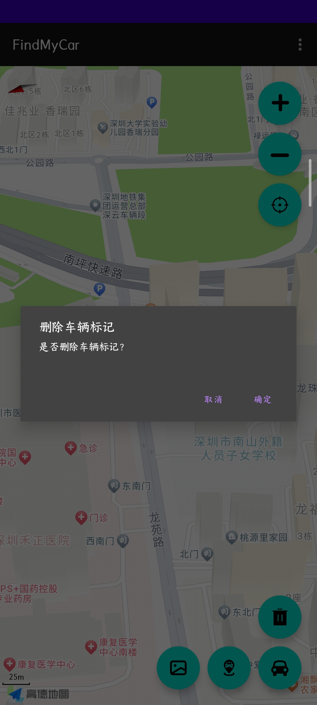
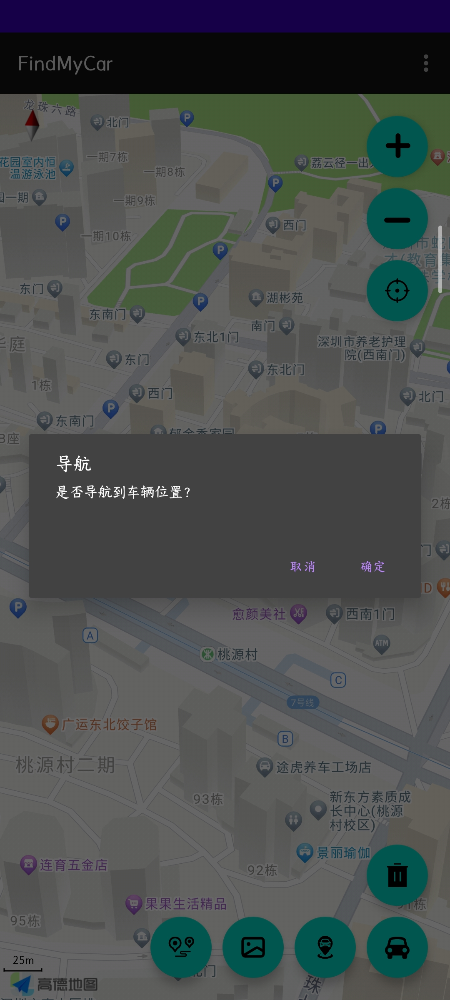

# FindMyCar

基于高德地图API的车辆定位安卓app

- 车辆定位功能
    - [x] 车辆位置标记
    - [x] 车辆位置图片
    - [x] 移动摄像机到车辆标点位置
- 导航至车辆位置
    - [x] ~~导航至车辆位置~~跳转至高德地图app导航

## 基础功能截图

1. 界面
   
2. 添加车辆标记
   
3. 添加车辆图片
   
4. 选择图片导入方式
   
5. 图片查看效果
   
6. 删除车辆标记
   
7. 跳转至高德地图并导航至车辆位置
   